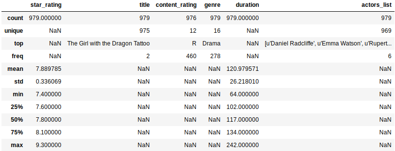
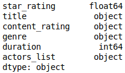

## Dot notation vs. bracket notation to select a Series
Each panda Series is essentially a column within a pandas DataFrame. 
Whenever a column is added to a DataFrame, the column name (Series) is added
 as an attribute on the pandas object. Series 
can be accessed through either dot notation or bracket notation:

```python
# See this code snippet in context at: https://youtu.be/zxqjeyKP2Tk
import pandas as pd
ufo = pd.read_table('https://raw.githubusercontent.com/justmarkham/pandas-videos/master/data/ufo.csv',
                   sep=',')
ufo_city = ufo['City']  # bracket notation
ufo_city = ufo.City  # dot notation
```

You must use bracket notation whenever there is:

- a space in the name of a Series
- a Series name that conflicts with a pandas method

You must also use bracket notation when you want to make a new Series:

```python
# See this code snippet in context at: https://youtu.be/zxqjeyKP2Tk
import pandas as pd
ufo = pd.read_table('https://raw.githubusercontent.com/justmarkham/pandas-videos/master/data/ufo.csv',
                   sep=',')
ufo['City_State'] = ufo['City'] + ', ' + ufo['State']
ufo.head()
```

## Keyboard tricks in Jupyter notebooks
- You can access all of an object's methods and attributes by typing 
`<name_of_the_pandas_object>.` + `TAB-key`. (That's the name of the pandas 
object, followed by a period and the tab key.)
- To see the optional or required parameters for a function or a method, when inside of the parentheses, hit `SHIFT` + `TAB` one, two, three, or four times.

## A few helpful methods and attributes
- `.describe(include='all')` a method that returns statistics about a 
DataFrame and produces results like this:

  
- `.shape` an attribute that returns a tuple with the number of rows and 
columns
- `.dtypes` an attribute that returns the types of each of the Series in 
the DataFrame, which produces results like this:

  

Note that -- just like in Python -- methods must be followed by `()` and 
attributes must not.